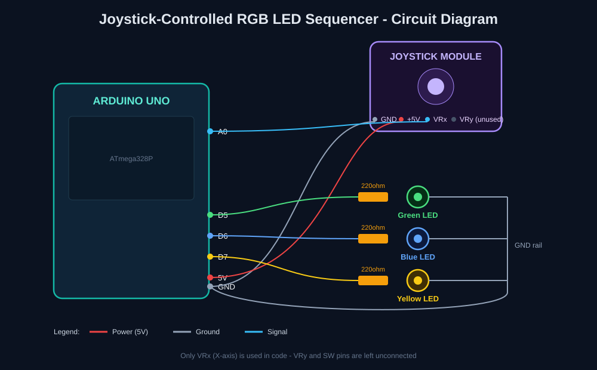
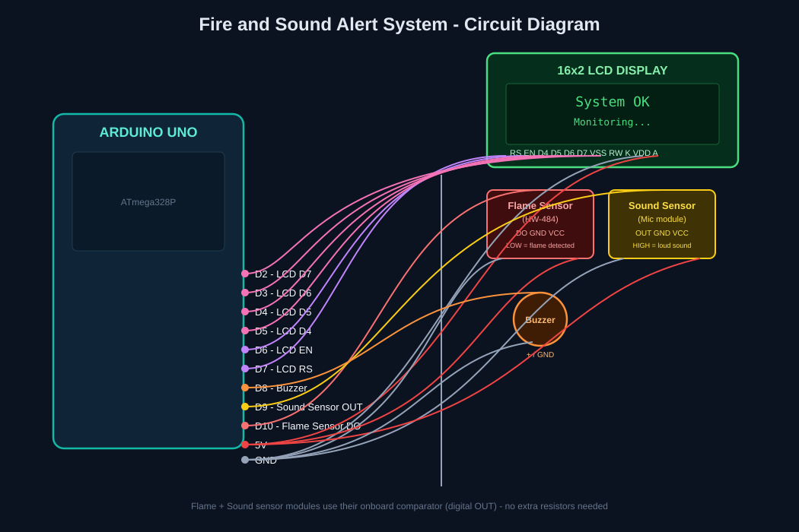
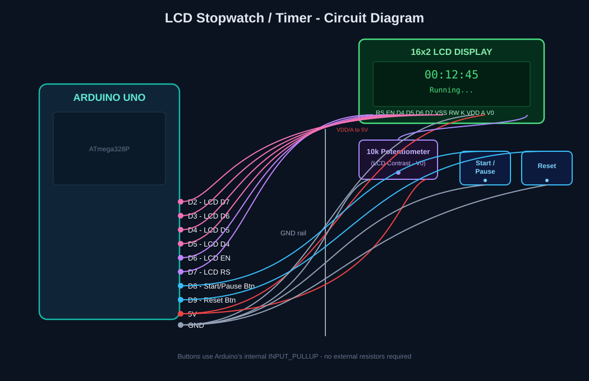

<h1 align="center">Hi there, I'm Maryam Afzaal 👋</h1>

  <b>Aspiring Mechatronics / Robotics Engineer 🤖 | Embedded Systems &amp; Arduino Enthusiast ⚡ | Creative Maker 🎨</b>

  
  
  

---

## 👩‍💻 About Me

Hi, I'm **Maryam Afzaal**, a student from **Pakistan**. I've completed my **Matriculation** and **Intermediate (ICS)**, and I'm just waiting on my 2nd year result now. My next step is applying directly to **universities** abroad for undergraduate programs in **Mechatronics, Robotics, or Aerospace Engineering**.

Right now I'm in the middle of applying to universities internationally, researching programs, working through application portals, writing personal statements, and looking into scholarship options. It's a big step, and I'm putting the same hands-on, figure-it-out energy into it that I put into my electronics projects.

I'm someone who genuinely enjoys **building things**, whether that's wiring up a circuit until an LED finally blinks the way it should, or sketching out an idea before turning it into a working prototype. I like understanding *why* something works, not just getting it to work, and that's what pulls me toward engineering in the first place.

 

## 🎯 What I'm Doing Right Now

- 🎓 Completed **Intermediate (ICS)**, waiting on my 2nd year result, and preparing university applications for **Mechatronics / Robotics / Aerospace Engineering**
- 🛠️ Building and documenting hands-on **Arduino & embedded electronics projects**
- 📝 Writing personal statements and application essays that highlight my project work
- 🌱 Learning something new in electronics or design every chance I get

 

## 🎨 Beyond Engineering

Engineering isn't the only thing I do. I have a pretty wide creative range, and I like keeping technical and creative skills close together:

| Category | What I Do |
|---|---|
| 🔌 Electronics | Arduino projects, circuit design & debugging |
| 🎮 3D & Design | Blender 3D modeling, CAD, graphic design |
| ✍️ Art | Calligraphy, sketching, painting |
| 🧵 Fashion | Textile & fashion design |
| 🎤 Other | Singing, and staying active with a calisthenics-based fitness routine |

I like moving between these. Going from a technical circuit diagram to a hand-sketched design in the same day keeps things interesting.

 

## 🧰 Tools &amp; Technologies

  
  
  
  
  
  
  
  

 

This profile is a home for my **Arduino / embedded electronics projects**, what I've already built, and what's coming next. Demo videos for each project are being added as I record them.

 

---

# ✅ Completed Projects

 

## 1️⃣ Joystick-Controlled RGB LED Sequencer

A joystick-based light sequencer, pushing the joystick left or right steps forward or backward through three LEDs (Green → Blue → Yellow), turning exactly one LED on at a time.

**📹 Demo video:** *(added separately)*

### 🔩 Components Used

| Component | Quantity | Purpose |
|---|---|---|
| Arduino Uno | 1 | Main microcontroller |
| 2-axis Analog Joystick Module | 1 | Direction input (X-axis only) |
| Green LED | 1 | Sequencer output, Step 1 |
| Blue LED | 1 | Sequencer output, Step 2 |
| Yellow LED | 1 | Sequencer output, Step 3 |
| 220Ω Resistor | 3 | Current-limiting for each LED |
| Breadboard | 1 | Prototyping |
| Jumper Wires | - | Connections |

### 🔌 Connections

| From | To |
|---|---|
| Joystick GND | Arduino GND |
| Joystick +5V | Arduino 5V |
| Joystick VRx | Arduino A0 |
| Joystick VRy, SW | Not used / not connected |
| Green LED (+) → 220Ω resistor | Arduino Pin 5 |
| Blue LED (+) → 220Ω resistor | Arduino Pin 6 |
| Yellow LED (+) → 220Ω resistor | Arduino Pin 7 |
| All LED (−) cathodes | Arduino GND |

### 🖼️ Circuit Diagram

### ⚙️ How It Works

The joystick's X-axis output is read on analog pin **A0**, giving a value between 0–1023 (≈512 at rest).

- Pushing the stick **left** (value `< 300`) moves the sequence **forward**, lighting the next LED in order: Green → Blue → Yellow.
- Pushing the stick **right** (value `> 700`) moves the sequence **backward**: Yellow → Blue → Green.
- A `currentLED` variable (0, 1, or 2) tracks which LED should be lit, and `updateLEDs()` turns **only that one LED on**, keeping the other two off.
- The index is clamped between 0 and 2 so it can't go out of range, and a small delay debounces repeated joystick pushes.

 

---

## 2️⃣ Fire &amp; Sound Alert System

A safety monitoring system that watches for **flame** and **loud sound** at the same time, displaying live status on an LCD and sounding a buzzer when something is detected.

**📹 Demo video:** *(added separately)*

### 🔩 Components Used

| Component | Quantity | Purpose |
|---|---|---|
| Arduino Uno | 1 | Main microcontroller |
| Flame Sensor (HW-484) | 1 | Detects fire/flame |
| Sound Sensor Module | 1 | Detects loud noise |
| Active Buzzer | 1 | Audible alert |
| 16x2 LCD Display (HD44780) | 1 | Live status display |
| Breadboard | 1 | Prototyping |
| Jumper Wires | - | Connections |

### 🔌 Connections

| From | To |
|---|---|
| LCD RS | Arduino Pin 7 |
| LCD EN | Arduino Pin 6 |
| LCD D4 | Arduino Pin 5 |
| LCD D5 | Arduino Pin 4 |
| LCD D6 | Arduino Pin 3 |
| LCD D7 | Arduino Pin 2 |
| LCD VSS, RW, K | Arduino GND |
| LCD VDD, A | Arduino 5V |
| Buzzer | Arduino Pin 8 |
| Sound Sensor OUT | Arduino Pin 9 |
| Flame Sensor DO | Arduino Pin 10 |

### 🖼️ Circuit Diagram

### ⚙️ How It Works

The Arduino continuously reads two digital sensors:

- **Flame Sensor (Pin 10):** goes **LOW** when flame/fire is detected.
- **Sound Sensor (Pin 9):** goes **HIGH** when a loud sound is picked up.

If flame is detected, the LCD immediately shows a **"FIRE ALERT"** message and the buzzer beeps rapidly (fast, urgent beeping); fire is treated as the highest priority and is checked first on every loop.

If no flame is detected but sound crosses the threshold, the LCD shows a **"Sound Detected"** message with a shorter beep.

When nothing is detected, the system shows a calm **"System OK / Monitoring..."** status, so it's clear the system is actively running.

 

---

## 3️⃣ LCD Stopwatch / Timer

A digital stopwatch built entirely with Arduino's internal timing (no RTC module needed), displaying minutes, seconds, and centiseconds on a 16x2 LCD with Start/Pause and Reset buttons.

**📹 Demo video:** *(added separately)*

### 🔩 Components Used

| Component | Quantity | Purpose |
|---|---|---|
| Arduino Uno | 1 | Main microcontroller (uses `millis()` for timing) |
| 16x2 LCD Display (HD44780) | 1 | Shows MM:SS:CS |
| Push Button | 2 | Start/Pause and Reset |
| 10kΩ Potentiometer | 1 | LCD contrast control |
| Breadboard | 1 | Prototyping |
| Jumper Wires | - | Connections |

### 🔌 Connections

| From | To |
|---|---|
| LCD RS | Arduino Pin 7 |
| LCD EN | Arduino Pin 6 |
| LCD D4 | Arduino Pin 5 |
| LCD D5 | Arduino Pin 4 |
| LCD D6 | Arduino Pin 3 |
| LCD D7 | Arduino Pin 2 |
| LCD VSS, RW, K | Arduino GND |
| LCD VDD, A | Arduino 5V |
| LCD V0 | Potentiometer wiper (contrast control) |
| Start/Pause Button | Arduino Pin 8 (other leg → GND) |
| Reset Button | Arduino Pin 9 (other leg → GND) |

> No external resistors are needed for the buttons; the Arduino's built-in `INPUT_PULLUP` resistors are used instead.

### 🖼️ Circuit Diagram

### ⚙️ How It Works

The stopwatch runs on Arduino's `millis()` function instead of a real-time clock module:

- **Start/Pause button (Pin 8):** the first press starts the timer by recording a start reference point; a second press pauses it and saves how much time has elapsed so far.
- **Reset button (Pin 9):** stops the timer and resets elapsed time back to zero.
- While running, the displayed time is calculated live as *(current time − start time)*; while paused, it holds the last saved elapsed time.
- The elapsed milliseconds are converted into **minutes, seconds, and centiseconds** and printed on the LCD in `MM:SS:CS` format, updating continuously.
- Both buttons use **debouncing** (a short delay after each press) so a single press isn't accidentally read as multiple presses.

 

---

# 🚧 Upcoming Projects

These are the next builds in progress. Details and circuit diagrams will be added once each project is complete.

### 📏 Ultrasonic Distance Measuring Device
An Arduino-based distance meter using an ultrasonic sensor to measure and display the distance to nearby objects in real time.

### 🎂 OLED "Happy Birthday" Display
An OLED screen project that displays an animated **"Happy Birthday"** message along with a matching sound/tune played through a buzzer or small speaker.

### 🎵 OLED Music Player with Animations
A small music player where a song plays through a speaker while the OLED display shows synced visuals/animations, combining sound and graphics in one project.

 

---

✨ More projects, demo videos, and circuit diagrams coming soon ✨

